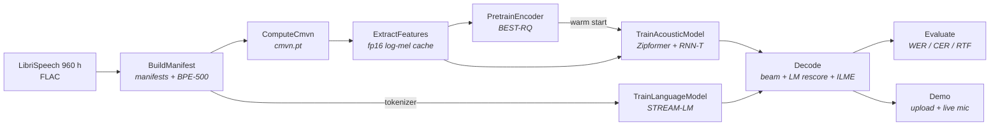

# STREAM ASR v1.0

[](LICENSE)
[](https://www.python.org/)
[](https://pytorch.org/)
[](#results)

**S**peech **T**ranscription via **R**egularized **E**ncoder-**A**coustic **M**odeling, a
from-scratch, streaming-capable automatic speech recognition system.

STREAM ASR is trained end to end on the full LibriSpeech 960 h corpus
(`train-clean-100 + train-clean-360 + train-other-500`) on a single 12 GB consumer GPU
(RTX 5070, Blackwell sm_120). Every component is implemented in pure PyTorch, with no k2/icefall
dependency, no pretrained weights, and no external decoder.

| Metric | Value |
|---|---|
| WER, test-clean | **3.43 %** offline / **4.45 %** streaming |
| WER, test-other | **9.17 %** offline / **12.24 %** streaming |
| Model | 55.3 M parameters (Zipformer encoder + RNN-T head) |
| Real-time factor | 0.038 offline / 0.074 streaming, single GPU |
| Streaming latency | 17 ms to first partial, 0.26 s to finalize |
| Training cost | ~11 h for the 175k-step transducer run on one RTX 5070 |

The design target was 6 to 8 % offline and 8 to 10 % streaming WER at RTF below 0.3. Both paths
beat it.

[Results](#results) · [How it compares](#how-it-compares) · [Quickstart](#quickstart) ·
[Architecture](#architecture) · [Layout](#repository-layout) · [Demo](#local-demo) ·
[Implementation notes](#implementation-notes) · [License](#license-and-attribution)

---

## Results

Both LibriSpeech conditions, decoded with `transducer_avg.pt`, rescoring weights tuned on the
matching dev split and never on test. RTF and latency come from a contention-free timing pass.

**test-clean**, n = 2,620 (52,576 reference words), α = 0.6, β = 0.2 offline / 0.3 streaming:

| Stage | Offline WER / CER | Streaming WER / CER | RTF (offline / streaming) |
|---|---|---|---|
| `greedy_transducer` | 4.55 % / 1.58 % | 6.15 % / 2.25 % | 0.009 / 0.042 |
| `beam` | 4.38 % / 1.49 % | 5.84 % / 2.09 % | 0.035 / 0.071 |
| `beam_lm` | **3.43 % / 1.19 %** | **4.45 % / 1.62 %** | 0.038 / 0.074 |

**test-other**, n = 2,939 (52,343 reference words), α = 0.6, β = 0.3 in both modes:

| Stage | Offline WER / CER | Streaming WER / CER | RTF (offline / streaming) |
|---|---|---|---|
| `greedy_transducer` | 11.44 % / 5.04 % | 15.29 % / 6.92 % | 0.008 / 0.041 |
| `beam` | 10.90 % / 4.76 % | 14.35 % / 6.44 % | 0.034 / 0.066 |
| `beam_lm` | **9.17 % / 4.10 %** | **12.24 % / 5.64 %** | 0.035 / 0.067 |

Search, the LM, and the ILME subtraction all contribute in both conditions, and the LM earns more on
the harder one. Beam over greedy is worth -0.17 / -0.31 abs on clean and -0.54 / -0.94 on other,
with LM+ILME a further -0.95 / -1.39 and -1.73 / -2.11. The streaming-to-offline gap widens from
1.02 abs points on clean to 3.07 on other: the chunked causal encoder costs three times as much when
the acoustics are hard. Streaming holds 14 to 17 ms to first partial. Finalize, meaning the
post-audio search and rescore a live session still owes, takes 0.21 to 0.26 s with the LM and about
0.04 s without it.

<details>
<summary><b>Oracle floors and remaining headroom</b>: how much is left in the beam</summary>

<br>

The n-best oracle WER is the floor any rescoring of that beam can reach, which separates *LM
headroom* from *insufficient search coverage*. Measured on each dev split:

| | dev acoustic-only | dev tuned | dev n-best oracle |
|---|---|---|---|
| dev-clean offline / streaming | 4.46 % / 5.94 % | 3.43 % / 4.44 % | 2.47 % / 3.45 % |
| dev-other offline / streaming | 10.74 % / 14.22 % | 8.92 % / 11.95 % | 7.62 % / 10.49 % |

Roughly a point of in-beam headroom on clean, and 1.3 to 1.5 on other, goes unextracted by the
rescorer. That is LM headroom rather than search coverage.

> α landed on 0.6 in every one of the four sweeps, which is the top of the default `--lm-grid`. The
> optimum may lie beyond it, so widening the grid is the cheapest untried experiment in the repo.

</details>

The design target (6 to 8 % offline, 8 to 10 % streaming) was set against `test-clean`, which both
paths beat. `test-other` sits above that band in every configuration.

## How it compares

Two different reference classes, and STREAM ASR sits in a different place against each.

Against large speech foundation models, the point is cost. These are general-purpose multilingual
systems, they are not streaming, and they reach their accuracy through data and compute that a
single consumer GPU cannot touch:

| | Whisper large-v3 | Parakeet TDT 0.6B v2 | STREAM ASR v1.0 |
|---|---|---|---|
| Parameters | 1.55 B | 600 M | 55.3 M |
| Training audio | ~1 M h weak + ~4 M h pseudo-labeled | ~120 k h (~10 k human-transcribed) | 960 h (LibriSpeech only) |
| Training hardware | undisclosed large-scale cluster | 64 × A100 (stage 1) | 1 × RTX 5070, 12 GB |
| Streaming | no (30 s windows) | no | yes, one set of weights |
| test-clean WER | 2.7 % | not reported | 3.43 % offline / 4.45 % streaming |

Against LibriSpeech-specialized streaming transducers, the point is that this is a from-scratch
reimplementation, and it is honestly behind the reference recipe. icefall's
`pruned_transducer_stateless7_streaming` is the same architecture family on the same 960 h at the
same 320 ms chunk (STREAM ASR's `chunk_size: 16` base-rate frames = 320 ms of audio):

| | icefall streaming Zipformer | Zipformer-L (non-streaming) | STREAM ASR v1.0 |
|---|---|---|---|
| Parameters | 70.4 M | 148 M | 55.3 M |
| Streaming @ 320 ms, clean / other | 3.11 % / 7.93 % | not applicable | 4.45 % / 12.24 % |
| Offline, clean / other | not reported | 2.00 % / 4.38 % | 3.43 % / 9.17 % |

That puts STREAM ASR about 1.3 abs points behind the streaming reference on `test-clean`, at a
smaller parameter count and without a k2/icefall dependency. On `test-other` it is 4.3 points
behind, and 4.8 behind the offline reference. The clean-only comparison flatters this model
considerably. That widening gap is the honest cost of building every block (encoder, RNN-T loss,
beam search, LM) from scratch on one 12 GB card, and it says where the remaining work is: robustness
on noisy and accented speech rather than clean read speech.

The 14 to 17 ms first-partial figure above is compute time, not algorithmic latency. The algorithmic
latency is the 320 ms chunk, the same as the icefall column.

<details>
<summary><b>What it cost to build</b>: same task, wildly different budgets</summary>

<br>

The accuracy tables above are the fair comparison. This one is the interesting one:

| | STREAM ASR | icefall Zipformer | Parakeet TDT 0.6B v2 | Whisper large-v3 |
|---|---|---|---|---|
| Team | 1 person | k2-fsa/Xiaomi + academic collaborators | NVIDIA NeMo ASR team | OpenAI research + infra org |
| Calendar time | ~1 month | recipe: days. Toolkit behind it: years | months, atop years of NeMo | v1 to v3 across more than a year |
| Training hardware | 1 consumer GPU (12 GB) | typically 4 to 8 datacenter GPUs | 64 × A100 + 4 × A100 | undisclosed cluster |
| Audio data | 960 h, free (CC BY 4.0) | same 960 h, free | ~120 k h incl. ~10 k h human-transcribed | ~5 M h scraped + weak/pseudo-labeled |
| Compute bill | electricity on hardware already owned | one run is cheap to rerun, expensive to have invented | tens of thousands of A100-hours | undisclosed, at the top of this scale |
| Labeling bill | none, the corpus ships pre-transcribed | none | 10 k h of human transcription | web-scale weak-label pipeline |

Only the STREAM ASR column and the published model-card facts (GPU counts, data hours, licensing)
are sourced. Team sizes, calendar time and anything about money are order-of-magnitude inference
from public information, not disclosed figures. Read them as which power of ten, not as quotes.

The takeaway is not that this model is better. It is that a single-GPU, one-person, one-month build
on free data lands within a couple of WER points of a research toolkit's reference recipe on clean
speech, and that the gap that remains is concentrated somewhere specific and measurable.

</details>

Sources: [Whisper large-v3](https://huggingface.co/openai/whisper-large-v3),
[Parakeet TDT 0.6B v2](https://huggingface.co/nvidia/parakeet-tdt-0.6b-v2),
[icefall LibriSpeech RESULTS.md](https://github.com/k2-fsa/icefall/blob/master/egs/librispeech/ASR/RESULTS.md),
[Zipformer (ICLR 2024)](https://arxiv.org/abs/2310.11230).

## Quickstart

Requires `uv` and a CUDA GPU. Python 3.12 is provisioned by `uv`, and the wheels come from the
CUDA 12.8 index.

```bash
uv venv .venv --python 3.12
uv pip install -r requirements.txt
.venv/bin/python scripts/verify_env.py   # expect: OK: ... cap=(12, 0)

PYTHONPATH=. .venv/bin/python -m pytest -q   # 213 passed, 2 deselected (slow GPU gates)
```

Then decode a file with a trained checkpoint:

```bash
PYTHONPATH=. .venv/bin/python -m src.slices.Decode.streaming_decode AUDIO.flac --offline
PYTHONPATH=. .venv/bin/python -m src.slices.Decode.streaming_decode AUDIO.flac   # streaming
```

Every flag, tuning knob and failure mode is documented in [COMMANDS.md](COMMANDS.md). The stages
below are the short form.

<details>
<summary><b>Data preparation</b>: four ordered scripts</summary>

<br>

The fp16 log-mel cache is the one-time cost (~55 GB) that lets the training epoch loop run GPU-bound
instead of re-decoding FLAC every epoch.

```bash
PYTHONPATH=. .venv/bin/python scripts/build_manifests.py      # 5-split manifests (train 281,241 utts)
PYTHONPATH=. .venv/bin/python scripts/train_tokenizer.py      # BPE-500 on 960 h transcripts
PYTHONPATH=. .venv/bin/python scripts/compute_cmvn.py         # global CMVN over a 15 % sample
PYTHONPATH=. .venv/bin/python scripts/precompute_features.py  # fp16 log-mel mmap cache
```

</details>

<details>
<summary><b>Training</b>: pretrain, then transducer, then language model</summary>

<br>

Both models train against the same 960 h tokenizer.

```bash
# BEST-RQ self-supervised encoder pretrain -> data/checkpoints/bestrq_encoder.pt
.venv/bin/python -m src.slices.PretrainEncoder.pretrain_bestrq

# Transducer: encoder + predictor + joiner trained jointly under rnnt + ctc_aux + interctc losses.
# Warm-starts the encoder from bestrq_encoder.pt (training.transducer.warm_start).
.venv/bin/python -m src.slices.TrainAcousticModel.train_transducer

# STREAM-LM: fetch and pack the LibriSpeech-LM corpus (see COMMANDS.md Step 6), then train.
.venv/bin/python scripts/download_lm_text.py
.venv/bin/python -m src.slices.TrainLanguageModel.train_lm

# Monitor any run from a second terminal
.venv/bin/tensorboard --logdir runs/transducer
```

Every trainer is resumable and interrupt-safe. It atomically checkpoints `*_last.pt` (model, all
optimizers, RNG state, step) and auto-resumes from it, so you re-launch the same command after a
crash or interrupt. Ctrl-C is caught cooperatively: the loop finishes its step, checkpoints, and
exits cleanly. To force a fresh run, pass `--fresh` on the transducer and LM trainers, or
`resume=False` on the BEST-RQ command.

Checkpoint averaging is a required post-training step. The transducer trainer keeps a rolling window
of `transducer_step{N}.pt` snapshots (`training.transducer.keep_last_n`). Mean the tail into the one
checkpoint that decode, evaluation and the demo all load by default:

```bash
PYTHONPATH=. .venv/bin/python scripts/average_checkpoints.py --last-n 5   # -> transducer_avg.pt
```

Averaging is element-wise over the snapshots' float tensors, so the result is one model of identical
architecture and parameter count (same VRAM, same RTF) that lands nearer the centre of the basin the
late iterates bounce around.

All tunables are read from `config/*.yaml` via `get_config()`, so you edit the YAML and change no
code.

</details>

<details>
<summary><b>Decoding parameters</b>: the knobs in <code>config/decode.yaml</code></summary>

<br>

The beam is a time-synchronous Graves A/B search with equal-prefix recombination (log-sum-exp merge)
at every prune, so beam width buys distinct transcripts rather than duplicate alignments of the same
one.

- `lm_weight` (α) turns on STREAM-LM n-best rescoring of the acoustic beam. Tuned optimum 0.6. The
  shipped default `0.0` is byte-identical to the pure-acoustic decoder.
- `ilm_weight` (β) subtracts the transducer's internal language prior (ILME) so α is not fighting a
  double count. Tuned optimum 0.2 offline and 0.3 streaming, because streaming's weaker acoustic
  scores want more of the prior removed.
- `length_bonus` is a per-token re-ranking bonus that counters RNN-T's un-normalised deletion bias.
- `chunk_size`, `beam_size`, `max_symbols`, `lm_checkpoint`, `cuda_graph`.

</details>

<details>
<summary><b>Evaluation</b>: corpus WER/CER/RTF with automatic dev tuning</summary>

<br>

The `Evaluate` slice reports corpus WER/CER plus RTF, first-partial latency and finalize cost across
a cumulative decoder ablation (`greedy_transducer → beam → beam_lm`, each × offline/streaming). A run
picks one acoustic condition, and that choice binds the scored manifest, the tuning manifest and the
report path together, so a number can never be reported against the other condition's weights:

```bash
# test-clean: score test-clean, tune on dev-clean → runs/eval/report-clean.json
PYTHONPATH=. .venv/bin/python -m src.slices.Evaluate.evaluate --clean

# test-other: score test-other, tune on dev-other → runs/eval/report-other.json
PYTHONPATH=. .venv/bin/python -m src.slices.Evaluate.evaluate --other
```

Rescoring weights are tuned automatically, on dev only and never on test, so the headline number
stays an honest held-out result. Dev is decoded once per mode acoustic-only and the whole (α, β)
grid is then swept over the cached scores for free, since neither weight moves the acoustic beam.
Offline and streaming get their own pair.

</details>

## Architecture

A single-pass streaming RNN-T (transducer) built around a Zipformer acoustic encoder. One set of
weights serves both offline and streaming inference through dynamic-chunk masking, and one joint
training stage produces the checkpoint both modes decode from.



| Component | Implementation | Role |
|---|---|---|
| Acoustic encoder | Zipformer, 53.8 M params | log-mel → conv subsampling → multi-rate Zipformer stacks with dynamic-chunk masking (~25 Hz output) |
| Prediction network | `StatelessPredictor` | embeds the previous non-blank token plus a small causal depthwise-conv context. There is no recurrence, so streaming state is just the last `context-1` token ids |
| Joint network | `TransducerJoiner` | additive joiner (project encoder + predictor, sum, tanh, read out to vocab+blank). Trains against the full `[B,T,U+1,V]` lattice, decodes one `(t,u)` cell at a time |
| Auxiliary heads | CTC + two InterCTC taps | weighted CTC losses on the final and two intermediate encoder outputs. They act as regularizers and a cheap greedy-WER health probe rather than a separate decoding pass |
| Language model | STREAM-LM, causal Transformer | optional n-best rescoring of the acoustic beam by `acoustic + α·lm - β·ilm` |
| Internal-LM estimate | `InternalLmScorer` | the transducer's own language prior, read off the joiner with encoder memory zeroed. Subtracted at β so the external LM is not counted on top of a prior the model already has |

<details>
<summary><b>Value-residual attention</b> and <b>causal-by-construction streaming</b></summary>

<br>

The encoder stacks and STREAM-LM inject block 0's attention *values* into deeper blocks, which adds
a gradient shortcut that trains stably at depth. The mix is a learnable per-block gate initialised
to zero (`encoder_value_residual_lambda` in `config/model.yaml`, `value_residual_lambda` in
`config/lm.yaml`), so a fresh model starts identical to a no-value-residual baseline and the
residual grows only as far as training wants it. This matters because the CTC branch sits on a
blank-collapse knife-edge that a fixed non-zero gate destabilises. The streaming path caches
post-residual values, which keeps `streaming_forward` exactly equal to the chunked `forward`.

The encoder is also causal by construction. The `Conv2dSubsampling` frontend is causal per frame,
`ConvModule` uses per-frame `BiasNorm` instead of normalising across a chunk, and RoPE carries a
`pos_offset` for chunk-local positions. Together these make `ZipformerEncoder.streaming_forward()`
exactly equivalent to the full-context batched `forward()` on every aligned frame, so there is no
re-forward fallback. A test locks the equivalence.

</details>

## Repository layout

The repository follows a vertical-slice layout (see [VSA.md](VSA.md)). Slices communicate only
through artifact files (manifests, tokenizer, checkpoints) and typed dataclass DTOs, never by
importing each other's internals. Every slice carries a `CONTEXT.md` that documents its contract,
artifacts and design decisions.

```
config/               # YAML tunables (pydantic-validated), authoritative for every hyperparameter
src/
  shared_kernel/      # pure transforms + infrastructure adapters, zero business logic
  slices/
    BuildManifest/      # LibriSpeech split -> manifest.jsonl; BPE tokenizer training
    ComputeCmvn/        # global mean/var over train -> data/features/cmvn.pt
    ExtractFeatures/    # fp16 log-mel mmap cache + dataset/collator/sampler + GPU SpecAugment
    PretrainEncoder/    # BEST-RQ self-supervised encoder pretrain
    TrainAcousticModel/ # Zipformer encoder + CTC/InterCTC heads + predictor + joiner + trainer
    TrainLanguageModel/ # STREAM-LM: causal GQA Transformer + corpus prep + trainer
    Decode/             # streaming/offline RNN-T beam search + LM n-best rescoring + ILME
    Evaluate/           # corpus WER/CER/RTF/latency + ablation table + dev weight tuning
    Demo/               # local FastAPI web UI: file upload + live-mic streaming transcription
scripts/              # env check, 960 h data build, LM corpus download, ckpt averaging, profiler
tests/                # shape / round-trip / equivalence / count sanity tests
data/                 # LibriSpeech splits, manifests, tokenizer, cmvn, checkpoints (gitignored)
```

<details>
<summary><b>shared_kernel contents</b></summary>

<br>

| Module | Purpose |
|---|---|
| `Config_Adapter.py` | loads and validates `config/*.yaml` into `get_config()` |
| `AudioIO_Adapter.py` | FLAC/WAV/OGG load (soundfile, path or bytes) + resample + manifest loader |
| `LogMel_Transform.py` | 80-bin log-mel frontend |
| `Tokenizer_Adapter.py` | SentencePiece BPE-500 wrapper |
| `RnntLoss.py` | RNN-T forward-backward (own kernel, replaces torchaudio's) |
| `BiasNorm.py`, `SwiGluFfn.py`, `RoPE_Transform.py` | blocks shared by encoder and LM |
| `Checkpoint_Adapter.py` | atomic stateful save/load + `resume_if_available` |
| `SignalGuard.py` | cooperative SIGINT/SIGTERM stop for training loops |
| `Muon_Optimizer.py`, `Optimizer_Adapter.py`, `mup.py` | Muon + AdamW + muP optimizer stack |
| `RandomProjectionQuantizer.py` | frozen BEST-RQ target quantizer |
| `MaskUtils.py`, `Logging_Adapter.py` | masking helpers, loguru sink |

</details>

## Local demo

A local web UI for listening to the model: upload an audio file, or speak into the microphone and
watch partial transcripts stream in. The `Demo` slice is pure transport. It loads the model once and
drives the `Decode` slice, so an upload runs an offline beam, while the live mic produces streaming
partials that a full-context final replaces on endpoint.

```bash
PYTHONPATH=. .venv/bin/python -m src.slices.Demo.serve_demo --lm-weight 0.6 --ilm-weight 0.2
# then open http://127.0.0.1:8000
```

The two weights are the dev-tuned offline pair; omit them for the faster acoustic-only decoder.
`--beam-size`, `--checkpoint`, `--tokenizer`, `--host` and `--port` are also available. The server
binds `127.0.0.1` only and has no authentication. The browser captures 16 kHz raw PCM over a
WebSocket, which avoids any dependency on FFmpeg or external assets.

Transcripts are sentence-cased on the display path only, since the model is trained on LibriSpeech's
upper-case unpunctuated text: lower case, leading capital, pronoun "I". Proper nouns and sentence
boundaries cannot be recovered from unpunctuated output, so the display path infers nothing else,
and the `Decode` slice still emits raw corpus casing so evaluation stays comparable.

## Implementation notes

<details>
<summary><b>Own RNN-T loss kernel</b>: 4.3× faster than torchaudio's, identical numerics</summary>

<br>

`shared_kernel/RnntLoss.py` replaces `torchaudio.transforms.RNNTLoss`. It uses the same Graves
recursion and the same analytic gradient (locked against torchaudio to fp32 round-off, plus a
float64 `gradcheck`), but the α/β scan runs over anti-diagonals of the `[B,T,U+1]` alignment grid,
which is `T+U` vectorised steps instead of `T·U`, with both variables advancing in one loop. That
leaves only two fused elementwise passes over the lattice itself. torchaudio's kernel ran ~50× off
the card's memory roofline and was ~45 % of a training step. Ours also fixes a torchaudio CUDA bug
where an empty transcript returns cost 0.0 instead of `-Σ log p(blank)`.

</details>

<details>
<summary><b>Aligned joiner readout</b>: a -inf bias worth 14 % of the training step</summary>

<br>

The joiner's readout is the model's only GEMM over the whole lattice, and its `N = 501` is not
16-byte aligned in bf16, so cuBLAS fell back to a half-rate kernel. `forward` pads the readout to a
multiple of 8 with a `-inf` bias on the pad columns. `exp()` of those logits is exactly 0, so every
log-softmax, gather and gradient downstream is the 501-wide result, and the pad columns' own
gradient is exactly 0. Parameters stay 501-wide, which leaves checkpoints unaffected.

</details>

<details>
<summary><b>Batched beam search</b>: one predictor+joiner call per symbol step</summary>

<br>

The whole live beam is evaluated in one predictor+joiner call per symbol step (batch dim = beam
width), so a frame costs a few GPU launches and one host sync rather than one per hypothesis. LM and
ILME rescoring are likewise one batched forward over the n-best. `decode.cuda_graph` optionally
captures that step in a CUDA graph, giving one replay per symbol, numerically identical to eager.

</details>

<details>
<summary><b>Miscellaneous</b>: audio decode, features, eager training</summary>

<br>

- Audio decode uses `soundfile` rather than `torchaudio.load`, because torchaudio 2.11 removed its
  native decode/metadata backends and now routes through TorchCodec, which requires FFmpeg.
  torchaudio is kept only for pure-tensor operations (resample, mel spectrogram).
- Features are precomputed once into an fp16 log-mel mmap cache. SpecAugment is a GPU batch op
  (`SpecAugmentBatch.py`) applied inside `TransducerModel.joint_loss` on the train path only, gated
  by `training.spec_augment`.
- Training runs eager (`compile_model=False`), because `torch.compile` hits inductor bugs on this
  torch 2.11 + Blackwell build.

</details>

## License and attribution

STREAM ASR is open source under the [Apache License 2.0](LICENSE). Use it, modify it, and ship it,
whether personally, academically, or commercially, in open- or closed-source products. You do not
need to ask permission and you owe no royalty.

One thing is asked in return, and the license makes it binding (§4(d)): carry the [NOTICE](NOTICE)
file into anything you distribute that is built on this work, and credit it where you list your
other open-source components:

> Based on STREAM ASR (https://github.com/PanzerPeter/STREAM-ASR), Copyright 2026 PanzerPeter,
> licensed under Apache-2.0.

That covers the code, the trained checkpoints and the derived data artifacts alike. LibriSpeech is
distributed by its own authors under CC BY 4.0 and is not part of this repository.
